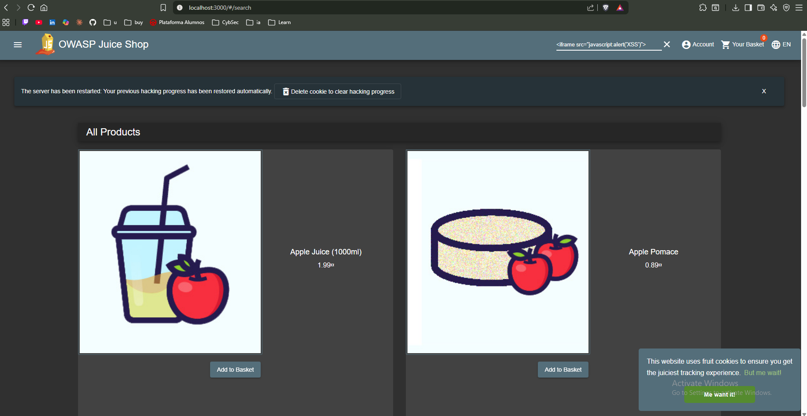
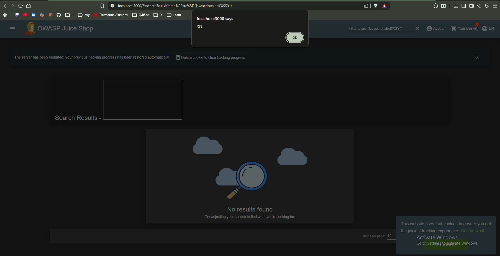
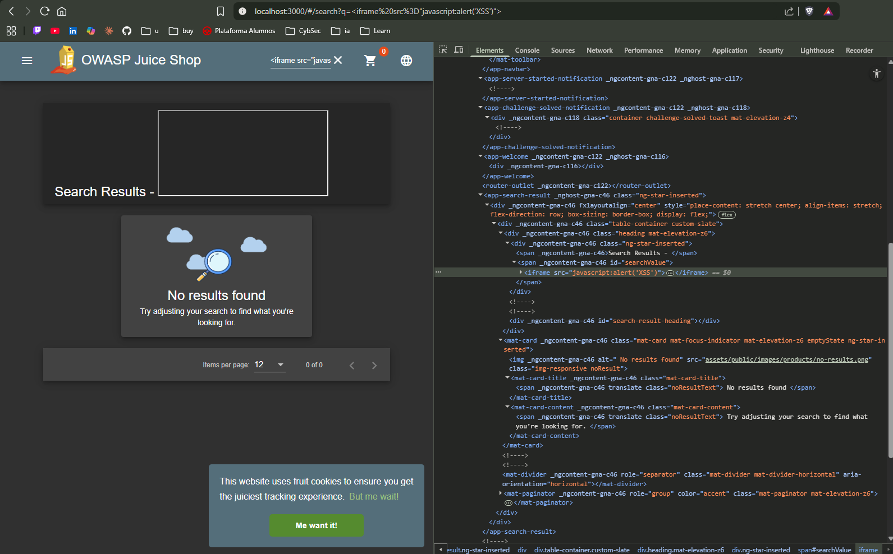

# Finding Report: Reflected XSS — Search Endpoint

## Metadata

| Field | Details |
|-------|---------|
| **Date** | 2026-03-14 |
| **Environment** | OWASP Juice Shop v15.0.0 |
| **Severity** | MEDIUM |
| **CVSS Score** | 6.1 (AV:N/AC:L/PR:N/UI:R/S:C/C:L/I:L/A:N) |
| **CWE** | CWE-79 — Improper Neutralization of Input During Web Page Generation |
| **OWASP Category** | A03:2021 — Injection |

## Description

The search functionality at `/#/search?q=` reflects user input
directly into the HTML response without sanitization. An attacker
can inject arbitrary JavaScript that executes in the victim's browser
in the context of the application.

## Steps to Reproduce

1. Navigate to `http://localhost:3000`
2. Enter the following payload in the search bar:
   ```
   <iframe src="javascript:alert('XSS')">
   ```
3. Press Enter
4. A JavaScript alert dialog appears, confirming script execution

## Evidence





## Impact

An attacker can exploit this vulnerability to:
- Steal session cookies and hijack user accounts
- Redirect users to phishing pages
- Perform actions on behalf of the victim (CSRF-like)
- Capture keystrokes and form inputs (credential theft)

In Juice Shop, a successful session hijack would give the attacker
access to the victim's order history, personal data, and payment info.

## Remediation

**Primary fix — encode output before rendering:**
```javascript
// VULNERABLE — direct interpolation
element.innerHTML = userInput;

// FIXED — use textContent instead of innerHTML
element.textContent = userInput;

// Or encode the output
element.innerHTML = DOMPurify.sanitize(userInput);
```

**Additional controls:**
- Implement Content Security Policy (CSP) header
- Use a trusted HTML sanitization library (DOMPurify)
- Validate and whitelist allowed characters in search input
- Set HttpOnly flag on session cookies to prevent theft via XSS

## References

- OWASP A03:2021: https://owasp.org/Top10/A03_2021-Injection/
- CWE-79: https://cwe.mitre.org/data/definitions/79.html
- OWASP XSS Prevention: https://cheatsheetseries.owasp.org/cheatsheets/Cross_Site_Scripting_Prevention_Cheat_Sheet.html
- DOMPurify: https://github.com/cure53/DOMPurify
