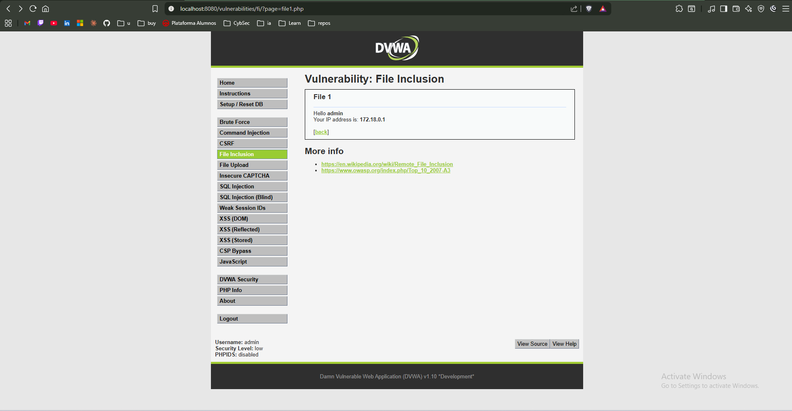

# Finding Report: Broken Access Control — Path Traversal

## Metadata

| Field | Details |
|-------|---------|
| **Date** | 2026-05-13 |
| **Environment** | DVWA (Damn Vulnerable Web Application) v1.10 |
| **Severity** | HIGH |
| **CVSS Score** | 7.5 (AV:N/AC:L/PR:N/UI:N/S:U/C:H/I:N/A:N) |
| **CWE** | CWE-22 — Improper Limitation of a Pathname to a Restricted Directory |
| **OWASP Category** | A01:2021 — Broken Access Control |

## Description

The File Inclusion functionality in DVWA accepts a `page` parameter
and includes the specified file without validating or sanitizing the
path. An attacker can use path traversal sequences (`../`) to escape
the intended directory and access arbitrary files on the server.

The server processed the traversal payload without error or access
control checks, confirming the vulnerability at the application level.
File contents were not rendered in the browser response due to
`allow_url_include = Off` in the PHP configuration — this is a
server-level setting, not a security control implemented by the
application itself.

## Steps to Reproduce

1. Navigate to DVWA and set Security Level to Low (DVWA Security → Submit)
2. Go to File Inclusion: `http://localhost:8080/dvwa/vulnerabilities/fi/`
3. Click any of the file links (e.g. `file1.php`) to confirm normal behavior
4. Modify the `page` parameter in the URL:
   ```
   http://localhost:8080/vulnerabilities/fi/?page=../../../../etc/passwd
   ```
5. Open DevTools (F12) → Network → reload the page
6. Click the request `fi/?page=../../../../etc/passwd` → Response Headers

## Evidence




> The server returned HTTP 200 OK with Content-Length: 1070 in response
> to the traversal payload. A 200 with non-zero content length confirms
> the input was not sanitized and reached the `include()` call.
> File rendering was suppressed by `allow_url_include = Off` at the
> PHP configuration level — this is not an application-level control.

## Impact

An attacker can read any file readable by the web server process:

- `/etc/passwd` — system user enumeration (demonstrated above)
- Application configuration files containing database credentials
- Private keys and certificates stored on the filesystem
- Application source code
- Log files containing sensitive information

In a production environment, this could lead to full server compromise
by exposing credentials or private keys accessible to the web server
process.

## Remediation

**Primary fix — whitelist allowed values:**

```php
// VULNERABLE — direct use of user input
$file = $_GET['page'];
include($file);

// FIXED — whitelist allowed files
$allowed = ['include.php', 'file1.php', 'file2.php'];
$page = $_GET['page'];
if (!in_array($page, $allowed)) {
    die('Access denied');
}
include($page);
```

**Additional controls:**

- Use `basename()` to strip directory components from user input
- Use `realpath()` and verify the resolved path starts within the
  expected base directory before including
- Run the web server process with minimum required filesystem permissions
- Implement proper access control checks before serving any file

## References

- OWASP A01:2021: https://owasp.org/Top10/A01_2021-Broken_Access_Control/
- CWE-22: https://cwe.mitre.org/data/definitions/22.html
- OWASP Path Traversal: https://owasp.org/www-community/attacks/Path_Traversal